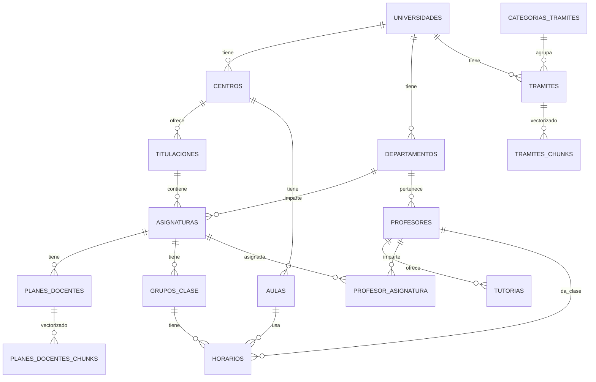

# Prompt para Claude: Arquitectura Chatbot Universitario LinceUS

## 📋 Contexto del Proyecto

### Información del TFG
- **Proyecto**: LinceUS Assistant - Chatbot Inteligente Universitario
- **Universidad**: Universidad de Sevilla - E.T.S. de Ingeniería Informática
- **Objetivo**: Asistente conversacional que centralice información académica/administrativa
- **Tecnologías**: Rasa + Supabase (pgvector) + Gemini API + React

### Funcionalidades Principales
- Sistema de preguntas y respuestas sobre consultas frecuentes de estudiantes
- Guía en procedimientos administrativos (matrícula, pagos, Erasmus, TFG, etc.)
- Acceso a información de facultades, departamentos y asignaturas
- Apoyo a estudiantes de nuevo ingreso (nacionales e internacionales)
- Sistema RAG (Retrieval-Augmented Generation) para consulta de documentos

---

## 🤖 Modelos de Ollama Instalados

Actualmente tengo instalados los siguientes modelos de Ollama en mi sistema:

```
NAME             ID              SIZE      MODIFIED    
llama3.2:3b      a80c4f17acd5    2.0 GB    13 días
llama3:latest    365c0bd3c000    4.7 GB    2 semanas
```

### Características de los Modelos

**llama3.2:3b** (2.0 GB)
- Modelo más ligero y rápido
- 3 mil millones de parámetros
- Ideal para respuestas rápidas y procesamiento local
- Menor latencia, adecuado para consultas frecuentes

**llama3:latest** (4.7 GB)  
- Modelo estándar de Llama 3
- Mayor capacidad de comprensión y generación
- Mejor para razonamiento complejo
- Recomendado para generación de texto estructurado

---

## 🗄️ Estructura de la Base de Datos

### Esquema Completo (PostgreSQL + pgvector en Supabase)



### Tablas Principales

#### 1. UNIVERSIDADES
```sql
- uuid id (PK)
- varchar codigo (UK) - Ej: "US"
- varchar nombre - "Universidad de Sevilla"
- varchar nombre_corto
- varchar dominio_web
- varchar ciudad
- boolean activa
- timestamptz created_at, updated_at
```

#### 2. CENTROS
```sql
- uuid id (PK)
- uuid universidad_id (FK)
- varchar codigo (UK) - Ej: "ETSII"
- varchar nombre - "E.T.S. Ingenieria Informatica"
- varchar direccion, telefono, email, web
- boolean activo
```

#### 3. TITULACIONES
```sql
- uuid id (PK)
- uuid centro_id (FK)
- varchar codigo - Ej: "GII-IS"
- varchar nombre - "Grado en Ing Informatica-Ing del Software"
- varchar tipo - "GRADO | MASTER | DOCTORADO"
- int plan_estudios_anio, creditos_totales, duracion_anios
- boolean activa
```

#### 4. ASIGNATURAS
```sql
- uuid id (PK)
- uuid titulacion_id (FK)
- uuid departamento_id (FK)
- varchar codigo - Ej: "2050001"
- varchar nombre - "Fundamentos de Programacion"
- int curso (1-4)
- decimal creditos (6 o 12)
- varchar duracion - "A | C1 | C2" (Anual, Cuatrimestre 1/2)
- varchar tipologia - "TRONCAL | OBLIGATORIA | OPTATIVA"
- boolean es_formacion_basica, es_optativa
- varchar nombre_normalizado
- text[] palabras_clave
- boolean activa
```

#### 5. PLANES_DOCENTES (Para RAG)
```sql
- uuid id (PK)
- uuid asignatura_id (FK)
- varchar curso_academico - "2025-26"
- varchar url_documento
- varchar hash_documento (SHA256)
- varchar estado_rag - "pendiente | procesando | completado | error"
- timestamptz fecha_procesamiento
```

#### 6. PLANES_DOCENTES_CHUNKS (Vectorización para RAG)
```sql
- uuid id (PK)
- uuid plan_docente_id (FK)
- text contenido
- vector embedding (768 dims) -- pgvector
- varchar seccion - "Evaluacion | Contenidos | Metodologia"
- int numero_pagina, orden_chunk
- jsonb metadata
```

#### 7. PROFESORES
```sql
- uuid id (PK)
- uuid departamento_id (FK)
- varchar nombre, apellidos, nombre_completo
- varchar email, telefono
- varchar despacho - Ej: "F1.45"
- varchar edificio, planta
- varchar web_personal, orcid
- boolean activo
```

#### 8. HORARIOS
```sql
- uuid id (PK)
- uuid grupo_id (FK)
- uuid aula_id (FK)
- uuid profesor_id (FK)
- int dia_semana (1-5)
- time hora_inicio, hora_fin
```

#### 9. TRAMITES (Para RAG de procedimientos administrativos)
```sql
- uuid id (PK)
- uuid universidad_id (FK)
- uuid categoria_id (FK)
- varchar titulo
- text descripcion
- varchar url_oficial
- text requisitos[], documentos_necesarios[]
- varchar plazo
```

#### 10. TRAMITES_CHUNKS (Vectorización)
```sql
- uuid id (PK)
- uuid tramite_id (FK)
- text contenido
- vector embedding (768 dims) -- pgvector
- jsonb metadata
```

---

## 🎯 Configuración Actual de Rasa

### Pipeline NLU (config.yml)
```yaml
language: es

pipeline:
  - name: WhitespaceTokenizer
  - name: LLMCommandGenerator
    llm:
      model: "ollama"
  - name: RegexFeaturizer
  - name: LexicalSyntacticFeaturizer
  - name: CountVectorsFeaturizer (word-level)
  - name: CountVectorsFeaturizer (char-level)
  - name: DIETClassifier (epochs: 150)
  - name: EntitySynonymMapper
  - name: ResponseSelector (epochs: 150)
  - name: FallbackClassifier (threshold: 0.6)
```

### Políticas de Diálogo (config.yml)
```yaml
policies:
  - MemoizationPolicy
  - RulePolicy (core_fallback_threshold: 0.4)
  - UnexpecTEDIntentPolicy (max_history: 5, epochs: 100)
  - TEDPolicy (max_history: 5, epochs: 100)
```

### Intenciones Principales (domain.yml)
```
- consultar_asignatura_db
- consultar_contexto_academico
- cambiar_contexto_academico
- pedir_mas_resultados
- pedir_ayuda
- greet, goodbye, affirm, deny
- bot_challenge
- nlu_fallback
```

### Entidades Detectadas
```
- nombre_centro (Ej: "ETSII")
- nombre_titulacion (Ej: "GII-IS", "Ingeniería del Software")
- nombre_asignatura (Ej: "Fundamentos de Programación")
- atributo_asignatura (Ej: "creditos", "curso", "codigo")
- filtro_curso (1, 2, 3, 4)
- filtro_tipologia (TRONCAL, OBLIGATORIA, OPTATIVA)
- filtro_duracion (Anual, C1, C2)
- filtro_creditos (6, 12)
```

### Sistema de Contexto Conversacional
El bot mantiene un **contexto académico persistente** durante la conversación:
- `contexto_centro`: Centro actual (por defecto "ETSII")
- `contexto_titulacion`: Titulación actual (por defecto "GII-IS")
- `asignaturas_memoria`: Historial de asignaturas consultadas
- `ultimos_resultados_asignaturas`: Caché de última búsqueda (para "dame más")

---

## 🎯 Objetivo: Mejor Solución para Chatbot Universitario

### Requisitos Clave

1. **Lenguaje Natural Avanzado**
   - Comprensión de preguntas complejas en español
   - Manejo de ambigüedades ("IS2" = "Ingeniería del Software 2")
   - Tolerancia a errores tipográficos y variaciones lingüísticas
   - Resolución de pronombres y referencias contextuales

2. **Consultas a Base de Datos Estructurada**
   - Traducción de lenguaje natural a consultas SQL precisas
   - Filtrado inteligente basado en contexto académico
   - Capacidad de consultas con múltiples filtros combinados
   - Búsqueda fuzzy para nombres de asignaturas/profesores

3. **Sistema RAG (Retrieval-Augmented Generation)**
   - Búsqueda semántica en planes docentes usando embeddings (pgvector)
   - Recuperación de información de trámites administrativos
   - Citación de fuentes (planes docentes, URLs oficiales)
   - Evitar alucinaciones: responder solo con información verificada

4. **Gestión de Diálogo Multi-Turn**
   - Mantener contexto conversacional entre turnos
   - Resolución de referencias anafóricas ("¿Y cuántos créditos tiene?")
   - Aclaración proactiva ante ambigüedades
   - Soporte para conversaciones ramificadas

5. **Rendimiento y Escalabilidad**
   - Respuestas en < 2 segundos para consultas DB
   - Respuestas en < 5 segundos para RAG
   - Capacidad para 50+ usuarios concurrentes
   - Cache inteligente de consultas frecuentes

6. **Seguridad y Privacidad**
   - Cumplimiento RGPD para datos de estudiantes
   - No almacenar información personal sensible
   - Control de acceso según permisos
   - Prevención de inyección SQL y prompt injection

---

## 🔧 Desafíos Técnicos a Resolver

### 1. **Integración LLM Local (Ollama) con Rasa**
   - ¿Usar Ollama para NLU o solo para generación de respuestas?
   - ¿Reemplazar DIET Classifier con fine-tuning de Llama 3?
   - ¿Híbrido: DIET para intenciones + Llama para entidades/razonamiento?

### 2. **Text-to-SQL vs. Consulta Semántica**
   - Actualmente: Busco por coincidencia de nombres en `nombre_normalizado`
   - Alternativa 1: LLM genera SQL directo (riesgo de inyección)
   - Alternativa 2: Embeddings para asignaturas + búsqueda vectorial
   - Alternativa 3: Sistema híbrido (estructurado + semántico)

### 3. **Estrategia de Embeddings**
   - Actual: 768 dimensiones para planes docentes
   - ¿Qué modelo de embeddings usar? (Opciones: OpenAI, local con sentence-transformers)
   - ¿Embeddings multilingües (español optimizados)?
   - ¿Chunk size óptimo para planes docentes? (actual: variable)

### 4. **Arquitectura de Acciones Personalizadas (actions.py)**
   - Actualmente: Una acción por intención + consulta DB
   - ¿Separar lógica en microservicios?
   - ¿Usar patrón Chain-of-Thought para consultas complejas?
   - ¿Implementar retry/fallback strategies?

### 5. **Balance Rasa vs. LLM Puro**
   - ¿Mantener Rasa para gestión de diálogo + Ollama para NLU?
   - ¿Migrar completamente a arquitectura LangChain/LlamaIndex?
   - ¿Usar Rasa como orquestador y LLM como componente?

---

## ✨ Pregunta Concreta para Claude

**Necesito tu recomendación experta sobre:**

### A) Arquitectura Óptima
Considerando:
- Modelos Ollama disponibles (llama3.2:3b y llama3:latest)
- Base de datos estructurada en Supabase (PostgreSQL + pgvector)
- Framework Rasa ya configurado
- Requisito de RAG para documentos académicos

**¿Cuál es la mejor arquitectura para integrar estos componentes?**

### B) División de Responsabilidades
**¿Qué componente debe hacer qué?**
- **Rasa**: ¿Solo gestión de diálogo o también NLU?
- **Ollama (Llama 3)**: ¿NLU, generación, text-to-SQL, o todo?
- **Supabase pgvector**: ¿Para qué tipo de búsquedas exactamente?
- **Custom Actions**: ¿Qué lógica debe ir aquí?

### C) Pipeline de Consulta
**Para una pregunta como:** *"¿Qué asignaturas optativas de 6 créditos hay en cuarto de mi carrera?"*

**¿Cuál es el flujo óptimo?**
1. Intent detection: ¿Rasa DIET o Llama 3?
2. Entity extraction: ¿RegEx + DIET o Llama 3 con prompt?
3. Query construction: ¿Text-to-SQL con LLM o búsqueda programática?
4. Response generation: ¿Template de Rasa o generación con Llama 3?

### D) Estrategia RAG
**Para consultas sobre planes docentes:**
- ¿Embedding model óptimo (local vs. API)?
- ¿Vector search puro o híbrido (keyword + semantic)?
- ¿Cómo integrar con Rasa para mantener coherencia de diálogo?
- ¿Estrategia de citación de fuentes?

### E) Performance y Escalabilidad
- ¿Usar llama3.2:3b para intenciones rápidas y llama3:latest para RAG?
- ¿Caching strategy para consultas frecuentes?
- ¿Cuándo usar procesamiento asíncrono?

---

## 📦 Código de Referencia Actual

### Estructura del Proyecto
```
linceus-assistant/
├── config.yml              # Pipeline Rasa + Políticas
├── domain.yml              # Intents, Entities, Slots, Responses
├── credentials.yml         # Conectores (REST, Telegram, etc.)
├── endpoints.yml           # Action server config
├── actions/
│   ├── actions.py          # Acciones personalizadas principales
│   ├── asignaturas.py      # Lógica consultas asignaturas
│   ├── db.py               # Conexión Supabase
│   ├── ollama_client.py    # Cliente Ollama
│   └── contexto.py         # Gestión de contexto académico
├── data/
│   ├── nlu/
│   │   ├── asignaturas.yml # Training data consultas asignaturas
│   │   ├── contexto.yml    # Training data contexto académico
│   │   └── general.yml     # Saludos, despedidas, etc.
│   ├── rules.yml           # Reglas conversacionales
│   └── stories.yml         # Historias de conversación
└── db_tables.md            # Esquema DB (este documento)
```

### Ejemplo de Consulta Actual (asignaturas.py)
```python
# Actualmente uso búsqueda simple por nombre normalizado
def buscar_asignatura_por_nombre(nombre: str, titulacion_id: str):
    nombre_norm = normalizar_texto(nombre)
    query = supabase.table('asignaturas') \
        .select('*') \
        .eq('titulacion_id', titulacion_id) \
        .ilike('nombre_normalizado', f'%{nombre_norm}%') \
        .limit(5) \
        .execute()
    return query.data
```

### Desafío
**¿Cómo mejorar esto usando:**
- Llama 3 para entender variaciones ("IS2" → "Ingeniería del Software 2")
- Embeddings para búsqueda semántica
- Text-to-SQL para consultas complejas con múltiples filtros

---

## 🎓 Backlog del Proyecto (Épicas)

1. ✅ **Épica Asignaturas** (En desarrollo)
   - Consultas básicas por nombre, código, curso
   - Filtros combinados (tipología + creditos + duracion)
   - Sistema de contexto académico

2. 🔄 **Épica Profesores** (Siguiente)
   - Búsqueda de profesores por nombre/departamento
   - Consulta de tutorías y horarios de atención

3. 📅 **Épica Horarios** (Pendiente)
   - Horarios de asignaturas/grupos
   - Disponibilidad de aulas

4. 📄 **Épica RAG - Planes Docentes** (Pendiente)
   - Búsqueda semántica en contenidos de asignaturas
   - Consultas sobre evaluación, bibliografía, temario

5. 🎫 **Épica Trámites Administrativos** (Pendiente)
   - Guía de procedimientos (matrícula, Erasmus, TFG)
   - RAG sobre documentación oficial

---

## 📋 Criterios de Éxito

### Testing
- **Rendimiento**: Respuestas en < 2s (DB) y < 5s (RAG)
- **Precisión**: 90%+ de intenciones correctamente clasificadas
- **RAG**: 0% alucinaciones (siempre citar fuente)
- **Seguridad**: Pasar tests de inyección SQL y prompt injection

### Usabilidad
- Manejo de conversaciones multi-turn (5+ intercambios)
- Tolerancia a errores tipográficos
- Respuestas naturales en español (no robóticas)

---

## 🙏 Petición Final

**Claude, necesito tu expertise para diseñar la arquitectura definitiva de este chatbot.**

Considerando:
- Los modelos Ollama que tengo (llama3.2:3b y llama3:latest)
- La base de datos estructurada en Supabase
- El framework Rasa ya configurado
- La necesidad de RAG para documentos académicos

**¿Cuál es la mejor solución técnica para lograr un chatbot universitario que:**
1. Entienda lenguaje natural en español con alta precisión
2. Consulte datos estructurados de forma inteligente (no solo keyword matching)
3. Recupere información de documentos usando RAG sin alucinar
4. Mantenga conversaciones coherentes multi-turn
5. Sea escalable y mantenible

**Proporciona:**
- Arquitectura detallada (diagrama de componentes)
- División clara de responsabilidades (Rasa vs Ollama vs Supabase)
- Pipeline completo para una consulta ejemplo
- Pseudocódigo o ejemplos de implementación clave
- Estrategia de embeddings y RAG
- Recomendaciones de rendimiento y testing

**Formato preferido:** Explicación técnica detallada con ejemplos de código Python.

---

**Gracias por tu ayuda para construir el mejor asistente universitario posible 🚀**
