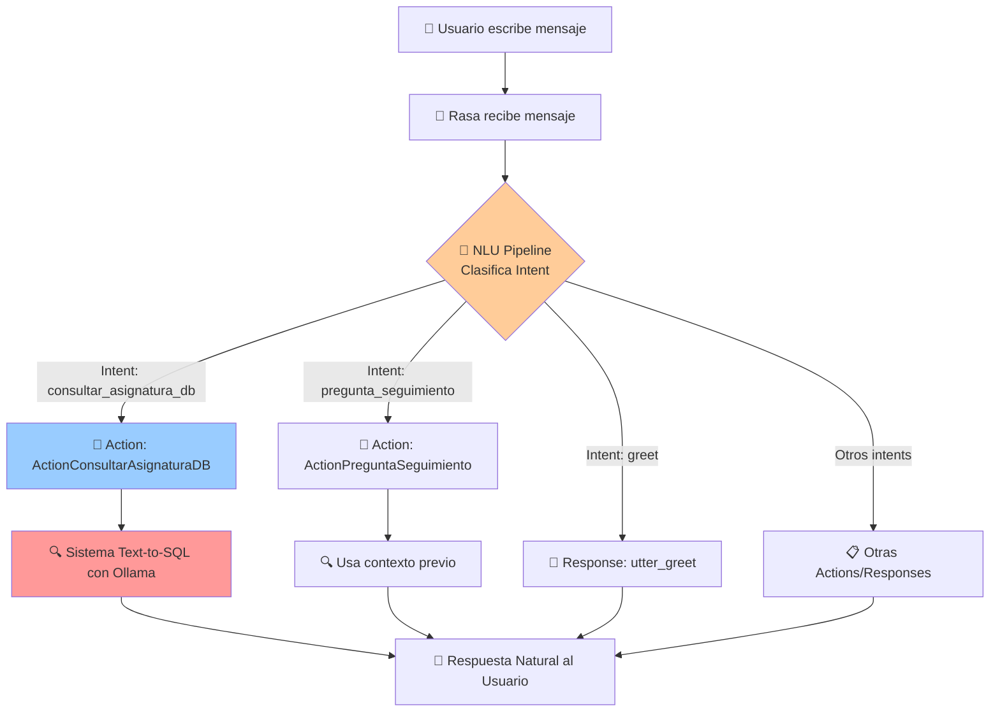
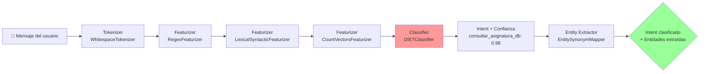
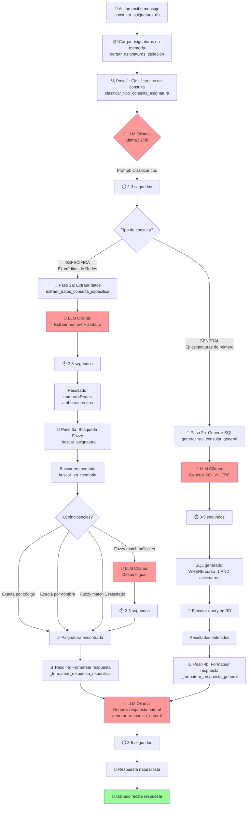
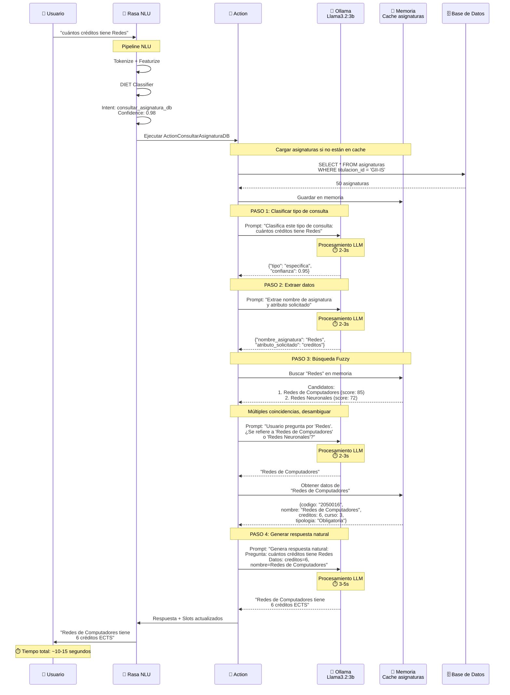
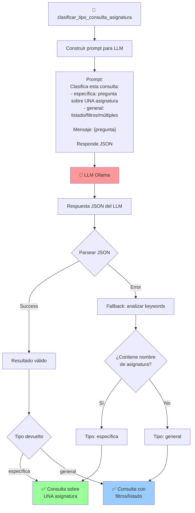
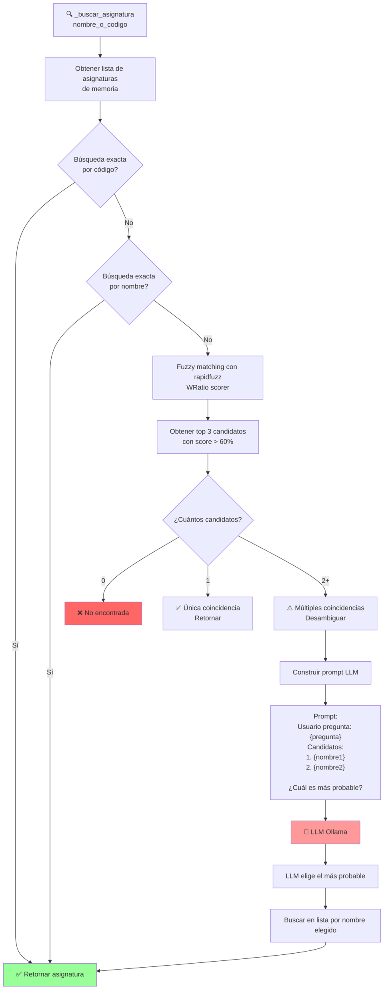
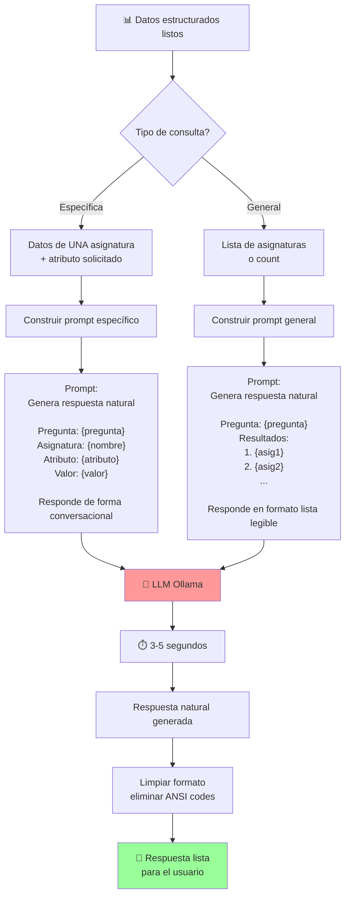
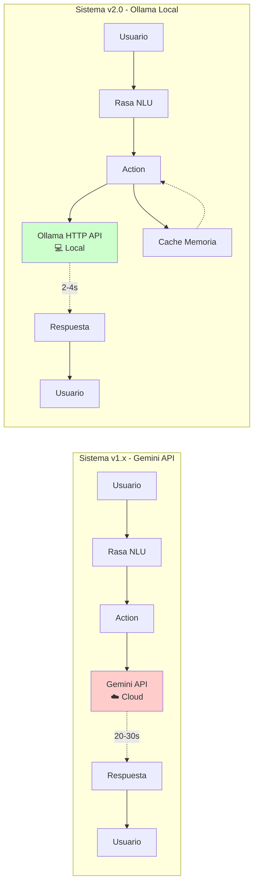

# Pipeline de Procesamiento de Mensajes - Sistema Linceus v2.0

Este documento explica el flujo completo de procesamiento de un mensaje desde que el usuario lo escribe hasta que recibe una respuesta.

---

## 🔄 Flujo General del Sistema



---

## 📊 Pipeline NLU de Rasa (Clasificación de Intent)

Este proceso ocurre **ANTES** de llamar a las actions, y determina qué intent tiene el mensaje.



**Ejemplo:**
```
Input: "cuántos créditos tiene Redes"
  ↓ Tokenizer: ["cuántos", "créditos", "tiene", "Redes"]
  ↓ Featurizers: [vectores numéricos]
  ↓ DIET Classifier: intent="consultar_asignatura_db" (conf: 0.98)
  ↓ Entity Extractor: (ninguna entidad detectada en este caso)
Output: Intent="consultar_asignatura_db"
```

---

## 🤖 Sistema Text-to-SQL con Ollama (ActionConsultarAsignaturaDB)

Una vez que Rasa clasifica el intent como `consultar_asignatura_db`, se ejecuta la action principal que usa Ollama.



---

## 🎯 Ejemplo Completo: "cuántos créditos tiene Redes"



---

## 🔍 Detalle: Clasificación de Tipo de Consulta



---

## 🔎 Detalle: Búsqueda Fuzzy con Desambiguación



**Ejemplo de desambiguación:**

```
Input: "Redes"

Candidatos encontrados:
1. Redes de Computadores (score: 85%)
2. Redes Neuronales (score: 72%)

Prompt a LLM:
"El usuario pregunta por 'Redes'. ¿Se refiere a:
1. Redes de Computadores (obligatoria, 3º curso)
2. Redes Neuronales (optativa, 4º curso)
Responde solo con el número."

LLM responde: "1"

Sistema retorna: "Redes de Computadores"
```

---

## 🎨 Detalle: Generación de Respuesta Natural



**Ejemplo:**

```
Input estructurado:
{
  "pregunta": "cuántos créditos tiene Redes",
  "asignatura": "Redes de Computadores",
  "atributo": "creditos",
  "valor": 6
}

Prompt al LLM:
"Genera una respuesta natural y conversacional.
Pregunta: cuántos créditos tiene Redes
Asignatura: Redes de Computadores
Atributo: creditos
Valor: 6

Responde en una frase natural."

LLM genera:
"Redes de Computadores tiene 6 créditos ECTS."

Output al usuario:
"Redes de Computadores tiene 6 créditos ETS."
```

---

## ⏱️ Tiempos de Procesamiento

```mermaid
gantt
    title Desglose de Tiempos (Consulta Específica)
    dateFormat X
    axisFormat %S seg

    section Rasa
    NLU Classification           :0, 1

    section Cache
    Cargar asignaturas (1ª vez)  :1, 2

    section Ollama
    Clasificar tipo              :2, 4
    Extraer datos                :4, 6
    Desambiguar (si necesario)   :6, 8
    Respuesta natural            :8, 12

    section BD
    Query resultados             :12, 13

    section Total
    Tiempo total                 :0, 13
```



| Operación | Tiempo | Notas |
|-----------|--------|-------|
| Rasa NLU | ~0.5-1s | Clasificación de intent |
| Cargar asignaturas | ~1-2s | Solo primera vez |
| LLM: Clasificar | ~2-3s | Con cache de modelo |
| LLM: Extraer | ~2-3s | |
| Búsqueda fuzzy | ~0.05-0.1s | En memoria |
| LLM: Desambiguar | ~2-3s | Solo si múltiples matches |
| Query BD | ~0.1-0.2s | |
| LLM: Respuesta natural | ~3-5s | |
| **TOTAL (sin desambiguación)** | **~8-12s** | |
| **TOTAL (con desambiguación)** | **~10-15s** | |

---

## 🔄 Comparación: Sistema Anterior vs Nuevo



| Aspecto | v1.x (Gemini) | v2.0 (Ollama) | Mejora |
|---------|---------------|---------------|--------|
| **Velocidad LLM** | 20-30s | 2-4s | **5-15x más rápido** |
| **Costo** | $0.10 por 1000 queries | Gratis | **100% ahorro** |
| **Dependencia** | Internet + API key | Local | **Mayor control** |
| **Privacy** | Datos en cloud | Datos locales | **Mayor privacidad** |
| **Cache** | No | Sí (memoria) | **Más eficiente** |

---

## 📚 Resumen para el Profesor

### Puntos Clave del Sistema:

1. **Rasa NLU Pipeline**: Clasifica el intent del usuario usando modelos de ML entrenados (DIET Classifier)

2. **Sistema Text-to-SQL**: Convierte lenguaje natural a consultas SQL estructuradas usando Llama 3

3. **Ollama Local**: LLM local que procesa 4 tipos de tareas:
   - Clasificar tipo de consulta
   - Extraer datos (nombre asignatura + atributo)
   - Desambiguar cuando hay múltiples coincidencias
   - Generar respuestas naturales

4. **Cache en Memoria**: Las asignaturas se cargan una vez por sesión, mejorando performance

5. **Búsqueda Fuzzy Inteligente**: Encuentra asignaturas incluso con errores ortográficos o nombres parciales

6. **Respuestas Naturales**: Elimina respuestas robóticas usando el LLM para generar texto conversacional

### Ventajas del Sistema v2.0:

- ⚡ **5-15x más rápido** que versión anterior
- 💰 **Sin costos de API** (100% local)
- 🔒 **Mayor privacidad** (datos no salen del servidor)
- 🎯 **Más preciso** (desambiguación inteligente)
- 💬 **Más natural** (respuestas conversacionales)
