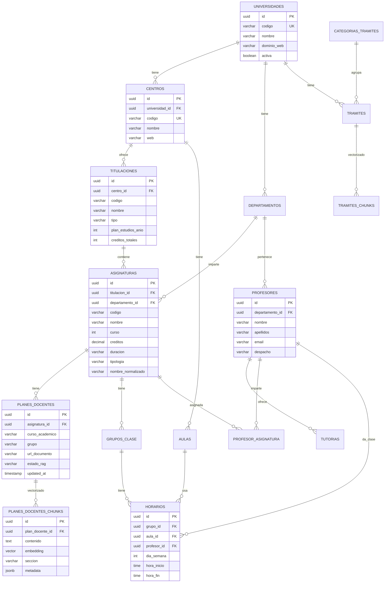

# Esquema de Base de Datos - TFG Chatbot Universidad de Sevilla

## Diagrama de Entidades Principal



## Jerarquía de Datos

```
Universidad de Sevilla (US)
└── E.T.S. Ingeniería Informática (ETSII)
    └── Grado en Ing. Informática - Ing. del Software (GII-IS)
        ├── Curso 1
        │   ├── Fundamentos de Programación (2050001) - 12 ECTS - Anual
        │   │   ├── Plan Docente 2025-26 Grupo 1
        │   │   │   └── Chunks RAG (evaluación, contenidos, bibliografía...)
        │   │   └── Plan Docente 2025-26 Grupo 2
        │   │       └── Chunks RAG...
        │   ├── Cálculo Infinitesimal y Numérico (2050002) - 6 ECTS - C1
        │   └── ...
        ├── Curso 2
        │   └── ...
        └── ...
```

## Módulos del Sistema

### 📚 Módulo 1: Estructura Académica
| Tabla | Descripción | Datos de origen |
|-------|-------------|-----------------|
| `universidades` | Universidad de Sevilla (escalable a otras) | Manual |
| `centros` | ETSII, Facultad de Matemáticas, etc. | Manual |
| `titulaciones` | Grados, másteres | Manual |
| `departamentos` | LSI, DTIS, etc. | Manual |
| `asignaturas` | **Solo datos del documento oficial** (ING_softw.pdf) | CSV/Script |

### 📄 Módulo 2: Planes Docentes + RAG
| Tabla | Descripción | Proceso |
|-------|-------------|---------|
| `planes_docentes` | Metadatos del plan docente por año/grupo | Extracción PDF |
| `planes_docentes_chunks` | **Vectorización para RAG** | Chunking + Embeddings |

**Columnas clave para RAG:**
- `embedding`: vector(768) - pgvector
- `seccion`: Para citar fuente (Evaluación, Contenidos, etc.)
- `metadata`: JSONB flexible
- `updated_at`: Detectar documentos actualizados

### 👨‍🏫 Módulo 3: Profesorado
| Tabla | Descripción |
|-------|-------------|
| `profesores` | Nombre, email, despacho |
| `tutorias` | Horarios de tutorías |
| `profesor_asignatura` | Relación N:M profesor-asignatura |

### 📅 Módulo 4: Horarios
| Tabla | Descripción |
|-------|-------------|
| `aulas` | Código, edificio, capacidad |
| `grupos_clase` | Grupo 1, Grupo 2, etc. por asignatura |
| `horarios` | Día, hora, aula, profesor |

### 📝 Módulo 5: Trámites + RAG
| Tabla | Descripción |
|-------|-------------|
| `categorias_tramites` | Matrícula, becas, certificados... |
| `tramites` | Trámite específico |
| `tramites_chunks` | **Vectorización para RAG** |

### 🤖 Módulo 6: Configuración Bot
| Tabla | Descripción |
|-------|-------------|
| `enlaces_utiles` | Fallback links por tema |
| `intents_fallback` | Respuestas predefinidas |

## Campos Especiales

### Búsqueda Fuzzy de Asignaturas
```sql
-- nombre_normalizado: sin tildes, minúsculas
-- Permite buscar "matematicas" → "Matemáticas"
-- Usa extensión pg_trgm para similitud
```

### Vectorización RAG
```sql
-- embedding vector(768)
-- Índice HNSW para búsqueda rápida
-- Función buscar_plan_docente() incluida
```

### Updated_at para RAG
```sql
-- Trigger automático en todas las tablas
-- Permite detectar planes docentes actualizados
-- Crucial para re-procesar embeddings
```

## Flujo de Datos por Épica

### Épica 1: Asignaturas v1 (Sprint 2-6)
```
ING_softw.pdf → Script Python → asignaturas
```

### Épica 2: Profesores (Sprint 7-8)
```
Web ETSII → profesores + tutorias + profesor_asignatura
```

### Épica 3: RAG Asignaturas v2 (Sprint 9-11)
```
PDFs proyectos docentes → planes_docentes → chunking → planes_docentes_chunks (embeddings)
```

### Épica 4: Horarios (Sprint 12)
```
Web horarios ETSII → grupos_clase + horarios + aulas
```

### Épica 5: RAG Trámites (Sprint 13)
```
Web US + PDFs → tramites → chunking → tramites_chunks (embeddings)
```

## Ejemplo de Consulta RAG

```sql
-- Buscar información sobre evaluación de una asignatura
SELECT * FROM buscar_plan_docente(
    query_embedding := '[0.1, 0.2, ...]'::vector,  -- Tu embedding de la pregunta
    asignatura_codigo := '2050001',                 -- Fundamentos de Programación
    curso_academico := '2025-26',
    limite := 5,
    umbral_similitud := 0.7
);

-- Resultado: chunks relevantes con similitud y sección para citar
```

## Escalabilidad Futura

El esquema está preparado para:

1. **Múltiples universidades**: Añadir UPO, UCO, etc.
2. **Múltiples carreras**: Añadir otras titulaciones de ETSII
3. **Multi-idioma**: Campo `idioma` en grupos
4. **Multi-tenant**: RLS preparado (comentado)

## Próximos Pasos

1. ✅ Crear esquema en Supabase
2. 📋 Sprint 2: Script carga CSV asignaturas desde ING_softw.pdf
3. 📋 Sprint 3: Primeras consultas Rasa → asignaturas
4. 📋 Sprint 7: Carga de profesores
5. 📋 Sprint 9: Pipeline RAG planes docentes
